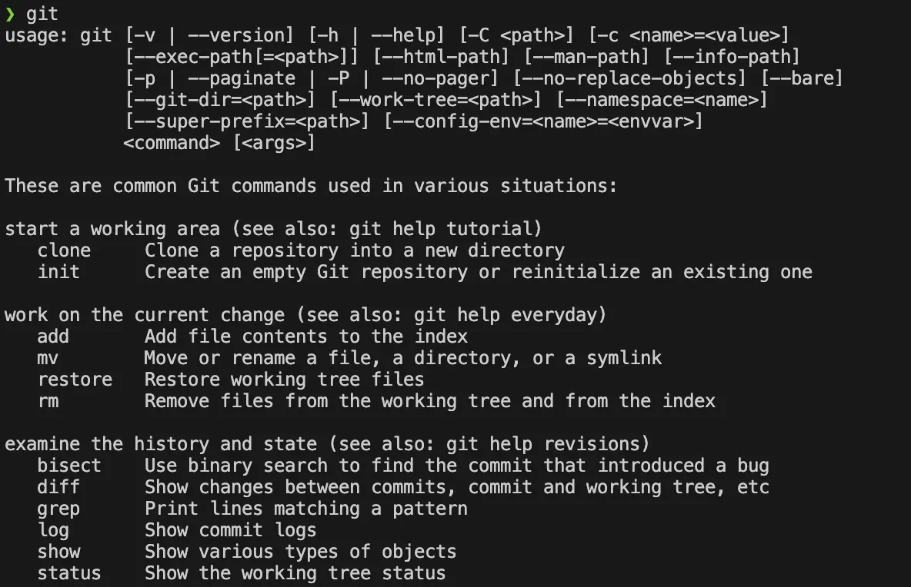

# Scripter son environnement de développement
## Qu'est-ce que le Scripting ?
> Scripting : écriture de scripts.

Des petits programmes informatiques qui automatisent des tâches répétitives ou complexes.

Les scripts sont généralement écrits dans des langages de script comme `Bash`, `PowerShell`, `Python`, etc. 

Ils permettent de :
- automatiser des processus
- configurer des environnements
- manipuler des fichiers
- et bien plus encore

Le scripting est une compétence essentielle pour tout développeur, car il permet de gagner du temps, d'améliorer la reproductibilité et de garantir la cohérence des configurations.


## Pourquoi Scripter son Environnement de Développement ?
### 1. Reproductibilité
L'un des principaux avantages de scripter votre environnement de développement est la reproductibilité. 

En ayant un script qui installe et configure tous les outils nécessaires, vous pouvez facilement recréer votre environnement sur une nouvelle machine. 

Cela est particulièrement utile si vous changez d'ordinateur ou si vous devez partager votre configuration avec un collègue.

### 2. Gain de Temps
Un script d'installation automatise le processus de configuration de votre environnement. 

Cela vous fait gagner un temps précieux, surtout si vous devez configurer plusieurs machines ou si vous devez réinstaller votre système d'exploitation.

### 3. Cohérence
Un script garantit que tous les membres de votre équipe ont le même environnement de développement. 

Cela réduit les risques de problèmes liés à des différences de configuration et facilite la collaboration.

### 4. Documentation
Un script sert également de documentation. 

Il décrit clairement quels outils et quelles configurations sont nécessaires pour votre projet. 

Cela peut être très utile pour les nouveaux membres de l'équipe ou pour vous-même si vous devez revenir à un projet après une longue période.

## Ouvrir un Terminal
### Sur Windows
1. **Utiliser la recherche Windows :**
   - Cliquez sur l'icône de la loupe dans la barre des tâches ou appuyez sur `Win + S`.
   - Tapez `cmd` ou `PowerShell`.
   - Cliquez sur `Invite de commandes` ou `Windows PowerShell`.

2. **Utiliser le menu Démarrer :**
   - Cliquez sur le bouton Démarrer.
   - Faites défiler jusqu'à `Système Windows` et cliquez sur `Invite de commandes` ou `Windows PowerShell`.

3. **Utiliser le raccourci clavier :**
   - Appuyez sur `Win + R`, tapez `cmd` ou `powershell`, puis appuyez sur `Entrée`.

### Sur macOS
1. **Utiliser Spotlight :**
   - Appuyez sur `Cmd + Espace` pour ouvrir Spotlight.
   - Tapez `Terminal` et appuyez sur `Entrée`.

2. **Utiliser le Finder :**
   - Ouvrez le Finder.
   - Allez dans `Applications` > `Utilitaires` > `Terminal`.

3. **Utiliser Launchpad :**
   - Ouvrez Launchpad.
   - Allez dans le dossier `Utilitaires` et cliquez sur `Terminal`.

### Sur Linux
1. **Utiliser le raccourci clavier :**
   - Appuyez sur `Ctrl + Alt + T` pour ouvrir le terminal.

2. **Utiliser le menu des applications :**
   - Ouvrez le menu des applications.
   - Recherchez `Terminal` et cliquez dessus.

## Lancer un script
### Sur Windows
```powershell
# cd : Cette commande signifie "change directory"
# naviguer entre les différents répertoires (folders) dans un système de fichiers
cd windows
.\demo.ps1
```

### Sur macOS
```shell
# cd : Cette commande signifie "change directory"
# naviguer entre les différents répertoires (folders) dans un système de fichiers
cd macos
# Ajoute le droit d'exécution (x pour eXecute)
chmod +x demo.sh
./demo.sh
```

### Sur Linux
```shell
# cd : Cette commande signifie "change directory"
# naviguer entre les différents répertoires (folders) dans un système de fichiers
cd linux
# Ajoute le droit d'exécution (x pour eXecute)
chmod +x demo.sh
./demo.sh
```

## Scripter son Environnement de Développement


- [Installer les pré-requis](PRE-REQUIS.md)
- Installer [`Visual Studio Code`](https://code.visualstudio.com/) via `install-vs.sh` qui vous permettra de visualiser / adapter les scripts
- Installer `git` en lançant le script `install-git`
   - Tester que tout est correct en lançant la commande suivante `git`
   - Vous devriez avoir la sortie suivante :



- Installer `gcc` en lançant le script correspondant `install-c`
- Tester que vous pouvez compiler via

```shell
gcc hello.c -o hello
./hello

# Vous devriez voir "Hello, World!"
```

- Installer [docker](https://www.docker.com/) via `install-docker`
   - Valider l'installation de docker en démarrant 1 container `php` via `install-php`
   - Le script va également installer [phpstorm](https://www.jetbrains.com/phpstorm)
   - Créer / configurer votre compte `jetbrains` afin d'utiliser votre license étudiante (adresse email `coda`)

- Installer les autres outils (JDK, NodeJS)

```shell
java -version

# Vérification des versions
node -v
npm -v
```

## Créer ton compte GitHub
Pour les besoins des cours, chaque étudiant·e doit disposer d’un compte GitHub.

1. Rendez-vous sur [https://github.com/](https://github.com/)
2. Cliquez sur **Sign up** (S’inscrire)
3. Suivez les instructions pour créer votre compte :
   - Entrez une adresse e-mail valide
   - Choisissez un nom d’utilisateur (il sera public)
   - Créez un mot de passe sécurisé
   - Validez l’adresse e-mail
4. Une fois votre compte créé et activé, connectez-vous.

# Livrable attendu
* [Instructions](LIVRABLE.md)
* [Barème de notation](BAREME.md)